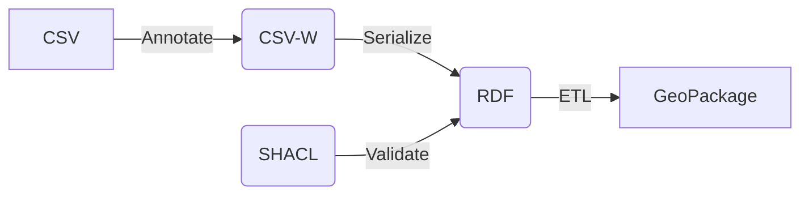

# Approaches to capture metadata at column level for tabular data

Different approaches exist to describe metadata at column level for tabular soil observation data. Some are embedded in existing metadata practices. The column metadata can be used to:

- improve discovery of datasets, by filtering on observed properties or procedures 
- validate if a CSV is valid
- provide overview statistics of a tabular dataset (min-max-avg)
- ingest data to a common model

A common factor in these approaches is that metadata (which property, which unit of measure, which procedure) is captured in a seperate metadata file which is connected to the data file. Notice that this approach requires that the procedure and unit are constant in the column. Data from different campaigns with different procedures or units can not be combined in a single file.

Notice that all these initiatives benefit from established vocabularies for soil properties and observation procedures, such as the vocabularies provided by [SoilWise](https://w3id.org/eusoilvoc)

## Approaches

### Soilwise CSV metadata

This is an approach suggested by SoilWise and not described elsewhere. Our suggestion is to create a second CSV file, {name}-metadata.csv, which contains metadata for each column in the data table(s). It is a tailored CSV format, every row on the table describes a column of a dataset. Notice that dataset metadata (title, abstract, ...) is stored in a separate file. This approach is appreciated by scientists because they can use a single tool.

table | column | title | description | datatype | information-role | property | unit | procedure
--- | --- | --- | --- | --- | --- | --- | --- | ---
loc.csv | ID | Identifier | Identification of the location | string | identification | identifier | |
loc.csv | Label | Label | A title of the location | string | attribute | name | |
obs.csv | Profile | Profile | Identifier of the sampling location, references loc.csv | loc.csv#ID | foreign key | identifier | |
obs.csv | N | Nitrogen | Measured Nitrogen in soil solution | numeric | observation | Nitrogen | mole/kg | TotalN_dc

### CSV-W 

[CSV on the web](https://www.w3.org/TR/tabular-data-primer/) is an initiative of W3C. 
A rich method to annotate CSV's, if properly set up, any tooling can generate full SOSA/SSN or Schema.org compatible RDF.

In SoilWise we're trying out various aspects of CSV-W:

- A [tool in Excel](./CSVW-Excel-Template/) to annotate an existing sheet
- A [LLM based variation to the annotation tool](https://dataannotator-swr.streamlit.app/) 
- A [tool](https://github.com/soilwise-he/data-download) and [online api](https://api.soilwise-he.containers.wur.nl/download/docs) to convert CSVW annotated data to RDF, geopackage or INSPIRE GML, based on [CSVWLIB](https://github.com/pvgenuchten/csvwlib/tree/latest) 
- A [validator tool](../RDF/shacl_sosa.ttl) to test if the generated RDF is valid for the SOSA ontology

Below is a diagram on how data can be converted from CSV to RDF and geopackage

A [sample](./examples/example3/obs.csv-metadata.json) of a csv-w context (metadata) file

### ISO19110 / ISO19115

[ISO19110 Standard on Feature cataloguing](https://www.iso.org/standard/57303.html) is an approach to describe columns in a dataset. Typical properties captured on a feature-attribute are type, uniqueness, etc. This approach does not facilitate rich observation metadata, such as observed property and procedure.

An interesting approach to work with iso19110/19115 metadata is the [MetadataControlFile](https://geopython.github.io/pygeometa/reference/mcf/) format. It is a convention of the geopython community. A subset of [iso19115](https://www.iso.org/standard/53798.html) encoded in YAML. Attributes in content info are extended to capture unit and procedure. See [sample](./mcf-sample.yml)

### OKFN Datapackage

Frictionless data is an initiative of [OKFN](https://okfn.org/en/). Fields from the standard [table-schema model](https://specs.frictionlessdata.io/table-schema/) could be extended to capture unit and procedure. See [sample](./datapackage-sample.json).

A specialisation of the table schema, focussed on observation data, is suggested by the [camtrap extension](https://camtrap-dp.tdwg.org/). 

### YARRRML Matey

[Matey](https://rml.io/yarrrml/matey/) is a `friendly` approach to work with rml.io, a modelling technique to model tabular data as RDF.

## Ontologies for (Soil) observation data

### SOSA/SSN

The [Semantic Sensor Network Ontology](https://www.w3.org/TR/vocab-ssn/) (SOSA-SSN) is a combined standard of W3C and OGC to describe observation and sampling data.
SOSA/SSN is the core of [Glosis-ld](https://glosis-ld.github.io/glosis/), an ontology specifically for soil observation data.

### schema.org

[Schema.org](https://schema.org) is a generic ontology originally developed to enrich websites with structured information. Schema.org includes the [observation](https://schema.org/Observation) concept, which captures 
aspects such as [Variable Measured](https://schema.org/variableMeasured), [Measurement Technique](https://schema.org/measurementTechnique) and [Unit Code](https://schema.org/unitCode).

## Data scenarios

A variety in data scenario's can be identified, which are commonly used in sharing soil observation data.

### Single table scenario

All observation data and sample identification are captured in a single table.

| ID | Label | X | Y | Profile | Label | Upper | Lower | Date | N | P | K |
| --- | --- | --- | --- | --- | --- | --- | --- | --- | --- | --- | --- |
| uae438 | 10m from street | 2.35 | 50.35 | O | 0 | 10 | 2025-10-04 | 0.3 | 0.01 | 0.01 |
| fte218 | 30m bhind barn | 2.45 | 51.15 | A | 10 | 30 | 2025-10-04 | 0.1 | 0.01 | 0.01 |

### Linked table scenario 

Assumes soil observation data in 1 or 2 related tables

`Sample locations`

| ID | Label | X | Y | Date |
| --- | --- | --- | --- | --- |
| uae438 | 10m from street | 2.35 | 50.35 | 2025-10-04 |
| fte218 | 30m bhind barn | 2.45 | 51.15 | 2025-10-04 |

`Observation data`

| Profile | Label | Upper | Lower |  N | P | K |
| --- | --- | --- | --- | --- | --- | --- | 
| uae438 | O | 0 | 10 |  0.3 | 0.01 | 0.01 |
| uae438 | A | 10 | 30  | 0.1 | 0.01 | 0.01 |
