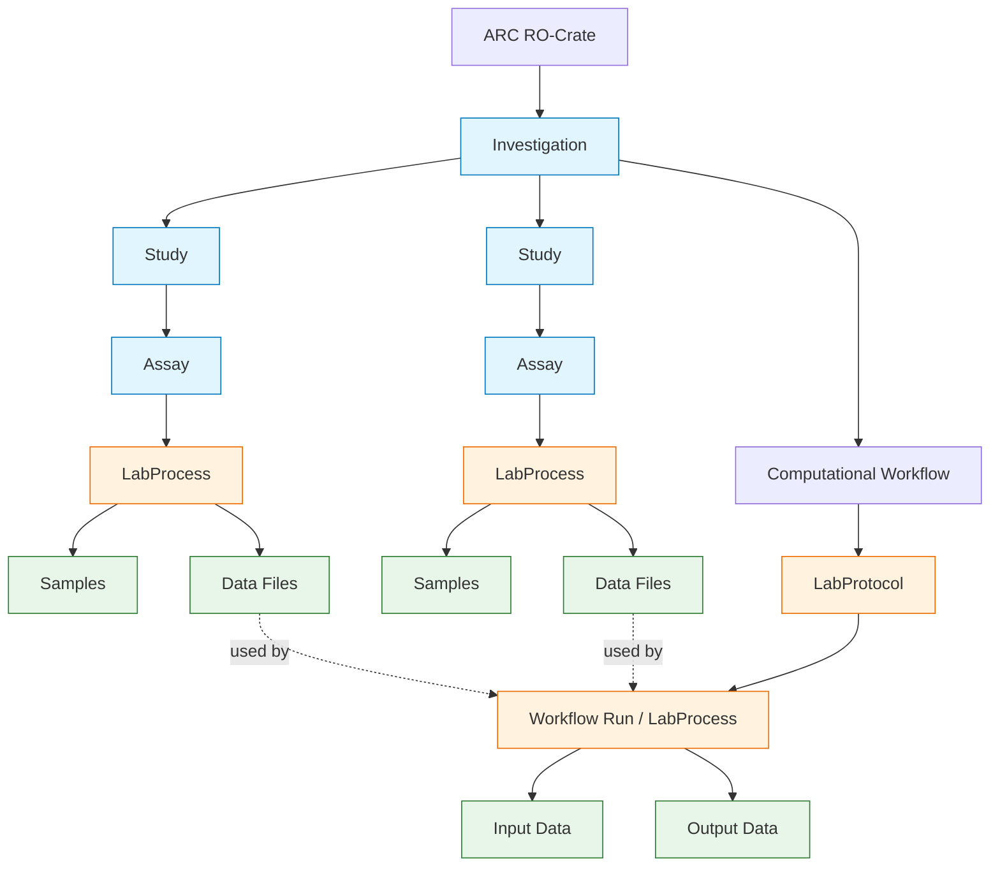
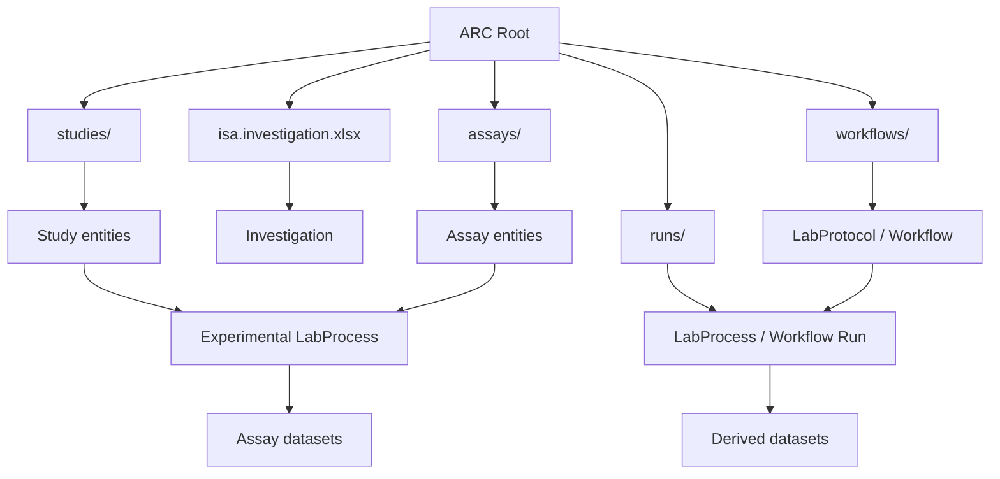

# ro-crate - ISA/ARC profile

ndfiplant endorses a [ro-crate profile adopting aspects of the ISA/ARC community](https://github.com/nfdi4plants/arc-ro-crate-profile). 
In discussion with the LTE community, this profile was suggested as relevant, also to the soil domain.
This repository contains some ongoing examples to study different ro-crate implementations, their validation and transformation.

[Ro-crate](https://www.researchobject.org/ro-crate/specification/1.1/) is an approach to package a data file with complete metadata on the context in which the file is procuded. It links the data file to its project, 
experiment setup and processing workflows.

The ro-crate can be deposited in Zenodo or in dedicated ro-crate hubs, like [fairdomhub](https://fairdomhub.org/)

The ISA/ARC profile adds labprocesses from the life sciences, using bioschemas.org. Basic principles such as data-referencing are explained in [this webpage](https://arc-rdm.org/details/documentation-principle/)

A nice visualisation of labprocess is available at <https://bioschemas.org/useCases/LabProcess>

## RO-crate editor

For basic ro-crate creation, use the LDACA [crate-o editor](https://language-research-technology.github.io/crate-o/#/), which allows to select a local folder and start annotating the files present

## FAIR data station

For more advanced uses of ARC/ISA profile, use [FAIR datastation](https://fairds.fairbydesign.nl/). Fair data station enables researchers to set up an excel template for their research. 
It uses existing vocabularies of observable properties and observation procedures to populate the Excel sheet.Researchers then populate the excel sheet with their results and upload it to the FAIR data station again.
There the file will be validated and observations poperly anootated follwing the ro-crate conventions. The crate can then be downloaded from the data station and deposited in Zenodo/Dataverse.

FAIR datastation uses common [vocabularies from the ENA](https://www.ebi.ac.uk/ena/browser/checklists) including soil, but these vocabularies can be extended in a tailored package.

## validator

ro-crates can be validated using [roc-validator](https://pypi.org/project/roc-validator/)

## diagrams

Structure of ro-crate ARC profile

Crate file structure

