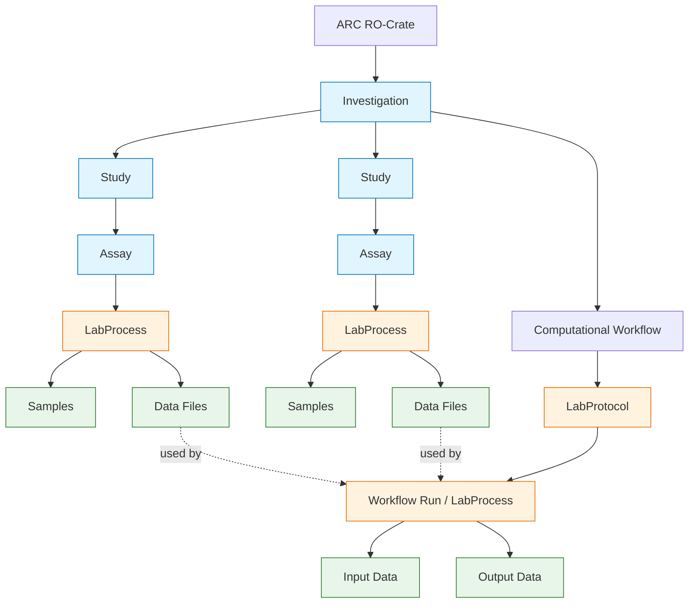
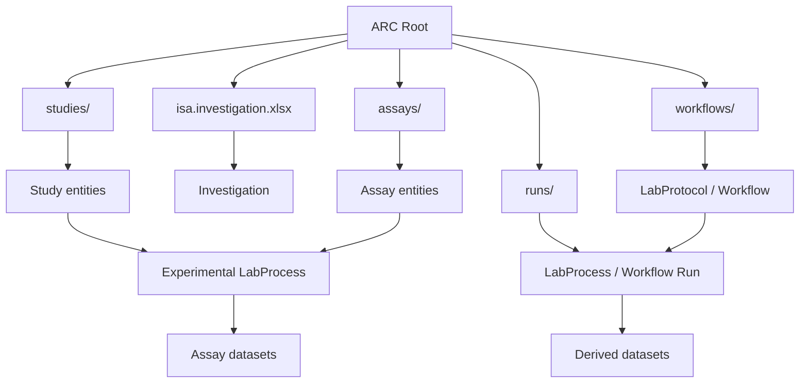

# RO-Crate - ISA/ARC profile

[RO-Crate](https://www.researchobject.org/ro-crate/specification/1.1/) is an approach to package a data file with complete metadata about the context in which the file is procuded. It links the data file to its project, 
experiment setup and processing workflows.

The RO-Crate can be deposited in Zenodo, Dataverse or dedicated RO-Crate hubs, like [fairdomhub](https://fairdomhub.org/). Datasets published via fairdomhub are ingested by OpenAire.

RO-Crate endorses groups such as Zenodo, Dataverse to adopt a [signposting](https://signposting.org) approach in which they [guide users directly to the RO-Crate](https://www.researchobject.org/ro-crate/specification/1.2/data-entities#retrieving-an-ro-crate) which further describes the resource. Providing a webby approach for [FAIR Digital Objects](https://fairdigitalobjectframework.org/). At the moment, Zenodo and Dataverse do not yet support this approach.

## Background

The German initiative [ndfiplant](https://www.nfdi4plants.org/) endorses a [ro-crate profile adopting aspects of the ISA/ARC community](https://github.com/nfdi4plants/arc-ro-crate-profile). 
In discussion with the LTE community, this profile was suggested as relevant, also to the soil domain.
This repository contains some ongoing examples to study different ro-crate implementations, their validation and transformation.

The ISA/ARC profile adds labprocesses from the life sciences, using bioschemas.org. Basic principles such as data-referencing are explained in [this webpage](https://arc-rdm.org/details/documentation-principle/)

A nice visualisation of labprocess is available at <https://bioschemas.org/useCases/LabProcess>

## RO-crate editor

For basic RO-Crate creation, use the LDACA [crate-o editor](https://language-research-technology.github.io/crate-o), which allows to select a local folder and start annotating the files present

## FAIR data station

For more advanced uses of ARC/ISA profile, use [FAIR datastation](https://fairds.fairbydesign.nl/). Fair data station enables researchers to set up an excel template for their research. 
It uses existing vocabularies of observable properties and observation procedures to populate the Excel template. Researchers then populate the excel template with their results and upload it to the FAIR data station again.
There the file will be validated and observations properly annotated following the ro-crate conventions. Data station can convert the crate to RDF or the excel can directyle be deposited in Zenodo/Dataverse. 
Interesting to invesitgate if also SOSA can be used as a base for the RDF serialisation (currently ro-crate is mainly schema.org/bioschemas.org based).

FAIR datastation uses common [vocabularies from the ENA](https://www.ebi.ac.uk/ena/browser/checklists) including soil, but these vocabularies can be extended in a tailored package.

At the moment discussion is taking place on a new ISA/ARC version of the profile. The FAIR data station experiences will certainly be integrated in the new profile.

## validator

ro-crates can be validated using [roc-validator](https://pypi.org/project/roc-validator/)

## diagrams

Structure of ro-crate ARC profile

```mermaid
graph TD

    ARC[ARC RO-Crate]

    ARC --> INV[Investigation]

    INV --> ST1[Study]
    INV --> ST2[Study]
    INV --> WF[Computational Workflow]

    ST1 --> AS1[Assay]
    ST2 --> AS2[Assay]

    AS1 --> LP1[LabProcess]
    AS2 --> LP2[LabProcess]

    LP1 --> S1[Samples]
    LP1 --> D1[Data Files]

    LP2 --> S2[Samples]
    LP2 --> D2[Data Files]

    WF --> PROTO[LabProtocol]
    PROTO --> RUN[Workflow Run / LabProcess]

    RUN --> IN[Input Data]
    RUN --> OUT[Output Data]

    D1 -. used by .-> RUN
    D2 -. used by .-> RUN

    classDef isa fill:#e1f5fe,stroke:#0277bd;
    classDef process fill:#fff3e0,stroke:#ef6c00;
    classDef data fill:#e8f5e9,stroke:#2e7d32;

    class INV,ST1,ST2,AS1,AS2 isa;
    class LP1,LP2,PROTO,RUN process;
    class S1,S2,D1,D2,IN,OUT data;
```

Crate file structure

```mermaid
graph TD

    ARC["ARC Root"]

    ARC --> INV["isa.investigation.xlsx"]
    ARC --> STUDIES["studies/"]
    ARC --> ASSAYS["assays/"]
    ARC --> WFS["workflows/"]
    ARC --> RUNS["runs/"]

    INV --> I["Investigation"]

    STUDIES --> S["Study entities"]
    ASSAYS --> A["Assay entities"]

    WFS --> WP["LabProtocol / Workflow"]
    RUNS --> RP["LabProcess / Workflow Run"]

    S --> LP1["Experimental LabProcess"]
    A --> LP1

    WP --> RP

    RP --> OUT["Derived datasets"]

    LP1 --> RAW["Assay datasets"]
```

## RO-Crate + CSVW

In theory a combination of RO-Crate and CSVW provides enough information to parse any tabular dataset.
However no single tooling seems to exist to parse a ro-crate including embedded csvw, however it can be managed in a 2 step process. Practical examples of this include: Language Data Commons of Australia (LDaCA): They use RO-Crates to make massive linguistic datasets accessible. In their Jupyter Notebook analysis environments, a script first scans the RO-Crate and then automatically extracts the correct [columns](https://www.ldaca.edu.au/resources/user-guides/crate-o/convert-spreadsheet/#columns) and data types via the CSVW standard to feed text analytics workflows. The Helmholtz Metadata Collaboration (HMC): In their Zeitgeist project (within the energy research domain), the backend supplies data as an RO-Crate, where the internal time series and measured values ​​are semantically described and loaded specifically via the CSVW standard.