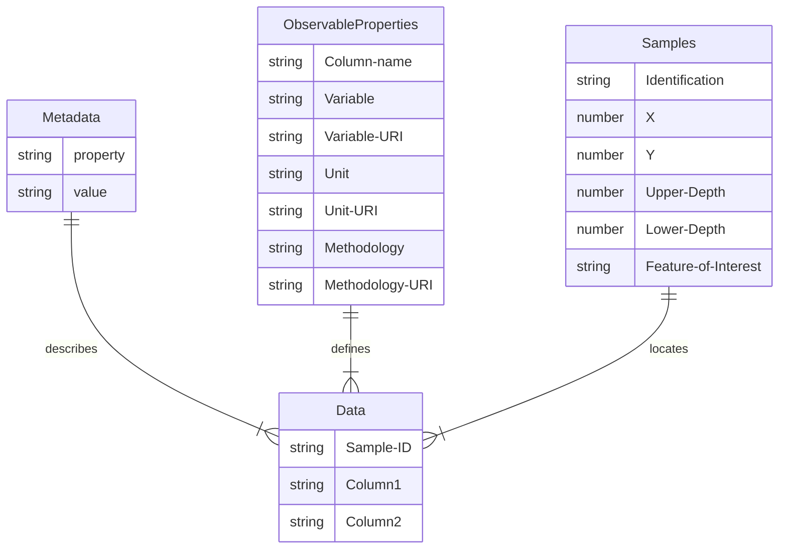

# Simple CSV
As a very simple approach to providing soil data, we describe an approach where all data is stored within a set of CSV files or a single Excel sheet with tabs:

- Metadata: general metadata applicable to the entire dataset. Includes concepts like title, author, license and CRS for spatial data.
- Observable Properties: list of all column headers describing an observed property. Includes methodology, Unit of Measurement, sample preparation. 
- Samples: description of the samples on which observations are made, samples refer to the features of interest (site, plot, profile, layer/horizon, sample).
- Data: the values in columns describe Observable Properties, rows describe Samples or Sites where observations are made on.

## Diagram

## Test the template on your data

Notice that this approach is valid for a single campaign only, using the same method and unit for all observations in a single column. 
If you need to capture data from different campaigns, using different units or procedures, use one of the other suggested approaches (or split the data per campaign).

- Download the [sample Excel sheet](https://github.com/soilwise-he/soil-observation-data-encodings/raw/refs/heads/main/SimpleCSV/SoilTemplate.xlsx) using the template.
- Copy your observation data to the `data` tab.
- Copy your samples data to the `samples` tab (make sure the samples are properly referenced from the data tab).
- For each observed property column in the data tab, add a line to the ObservableProperties tab, and complete the field metadata. 
- Check vocabularies such as the [soilvoc](https://w3id.org/eusoilvoc) if relevant uri's are available for the properties and procedures you have used.
- Upload your excel into the annotator tool to validate the excel and download the dataset in alternate formats.
