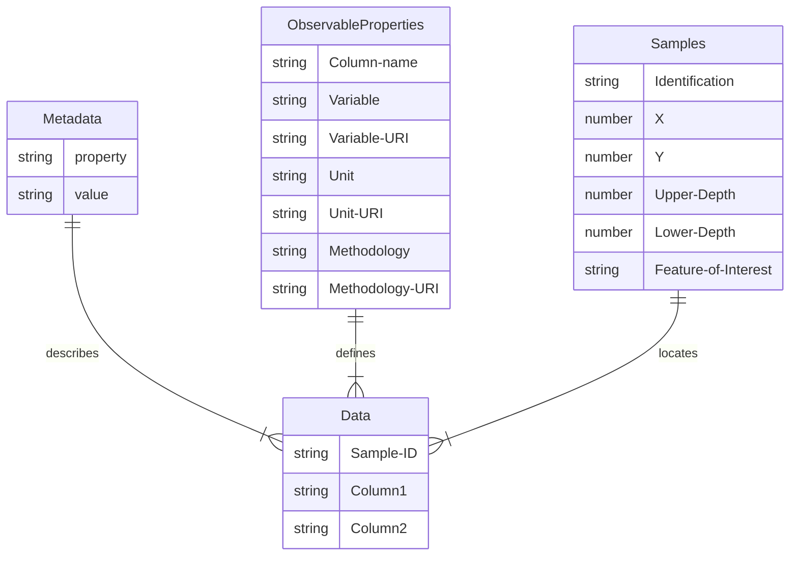

# Simple CSV
As a very simple approach to providing soil data, we describe an approach where all data is stored within a set of CSV files or a single excel sheets with tabs:
- Metadata: general metadata applicable to the entire dataset. Includes concepts like CRS for spatial data
- Observable Properties: list of all column headers describing an observed property. Includes methodology, Unit of Measurement, sample preparation. If the same property is provided using 2 methodologies, one entry must be provided per methodology
- Samples: description of the samples on which observations are made, samples refer to the features of interest (site, plot, profile, layer/horizon, sample)
- Data: the values, columns describe Observable Properties, rows describe Samples or Sites where observations are made on

## Diagram

