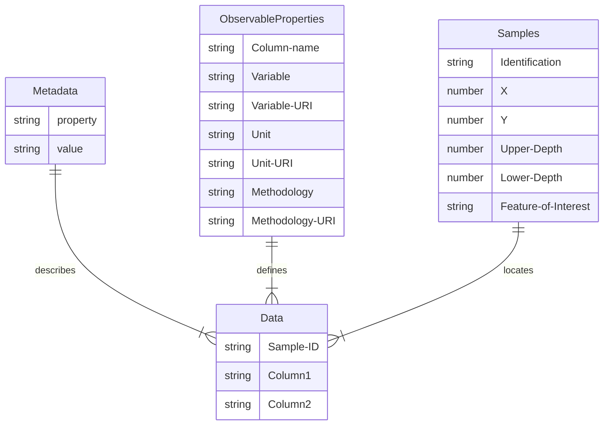

# Simple CSV
A simple approach to providing soil data, describe an approach where all data is stored within a set of linked CSV files or an Excel sheet with tabs.

Notice that this approach is valid for a single campaign only. Only a single method and unit can be used for all observations in a single column. 
If you need to capture data from different campaigns, using different units or procedures, then use one of the other suggested approaches (or split the data per campaign).

The following tables are proposed:

- Metadata: general metadata applicable to the entire dataset. Includes concepts like title, author, license.
- Observable Properties: list of all observed properties (which are the columns in the Data table). For each property you can provide the used Methodology and Unit of Measurement. 
- Samples: description of the samples or locations on which observations are made, samples refer a concept for which the sample is representative (site, profile, layer/horizon).
- Data: the actual observation data, columns are the observed properties, rows the samples.

## Diagram

## Test the template on your data

- Download the [sample Excel sheet](https://github.com/soilwise-he/soil-observation-data-encodings/raw/refs/heads/main/SimpleCSV/SoilTemplate.xlsx) using the template.
- Copy your observation data to the `data` tab.
- Copy your samples data to the `samples` tab (make sure the samples are properly referenced from the data tab).
- For each observed property column in the data tab, add a line to the ObservableProperties tab, and complete the field metadata. 
- Check vocabularies such as the [soilvoc](https://w3id.org/eusoilvoc) if relevant uri's are available for the properties and procedures you have used.
- Upload your excel into the annotator tool to validate the excel and download the dataset in alternate formats.
